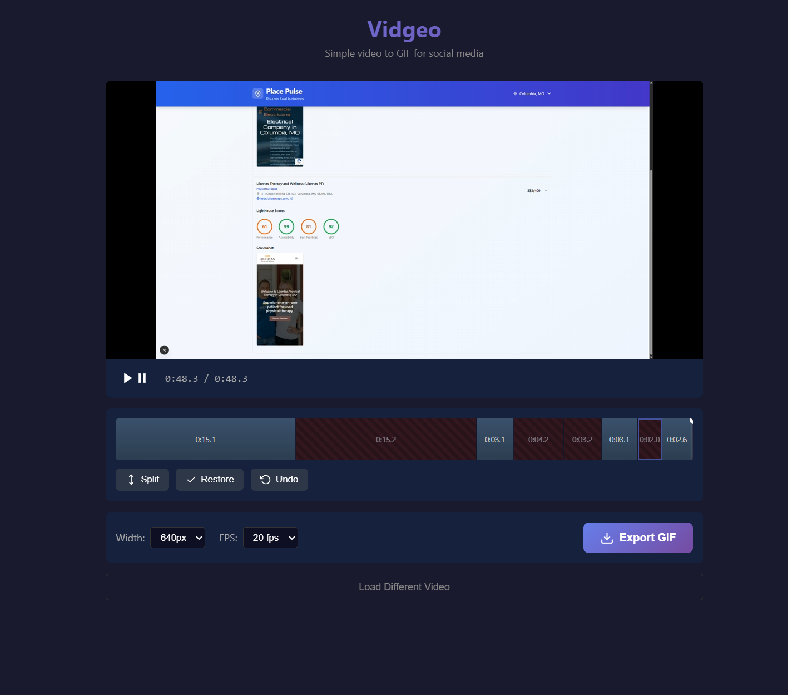

# Vidgeo

No nonsense video to GIF converter that runs entirely in your browser.



## Features

- **100% client-side** - Your videos never leave your device
- **Drag & drop** video upload (MP4, WebM, MOV)
- **Timeline editor** to split and trim your video
- **Delete segments** you don't want in the final GIF
- **Configurable output** - Choose width (320-800px) and FPS (10-30)
- **Undo support** - Ctrl+Z to revert changes

## Usage

1. Upload a video by dragging it onto the page or clicking to browse
2. Use the timeline to split the video at any point
3. Click segments to select them, then delete the parts you don't want
4. Choose your desired width and FPS
5. Click Export GIF

## Keyboard Shortcuts

| Key              | Action                  |
| ---------------- | ----------------------- |
| Space            | Play/Pause              |
| S                | Split at playhead       |
| Delete/Backspace | Delete selected segment |
| Ctrl+Z           | Undo                    |
| Left Arrow       | Step back 0.1s          |
| Right Arrow      | Step forward 0.1s       |
| Shift+Left       | Step back 1s            |
| Shift+Right      | Step forward 1s         |

## Running Locally

```bash
# Any static file server works
./serve.sh
# or
npx serve
# or
python -m http.server
```

Then open `http://localhost:8000` (or whatever port your server uses).

## How It Works

Vidgeo uses [FFmpeg WASM](https://ffmpegwasm.netlify.app/) to process videos entirely in the browser. When you export:

1. Your video is written to FFmpeg's virtual filesystem
2. Selected segments are extracted and concatenated
3. The result is converted to an optimized GIF with a custom palette
4. The GIF downloads automatically

## Credits

This project was entirely vibe coded by Claude Opus 4.5.
